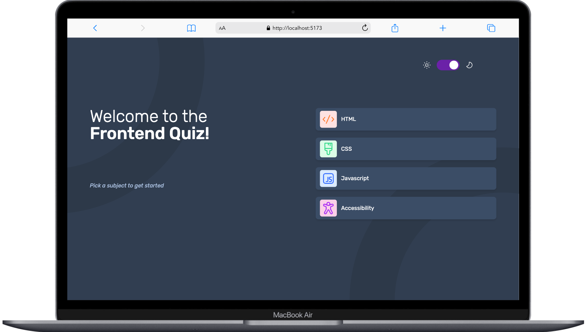
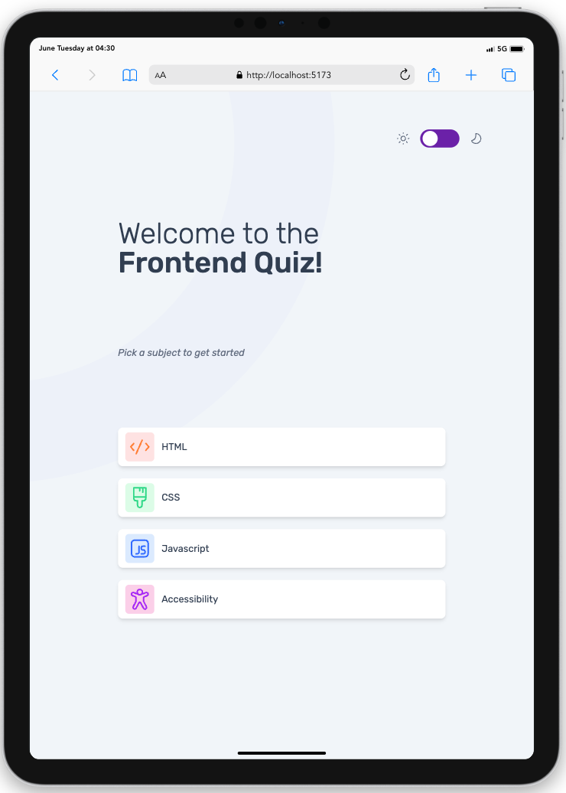
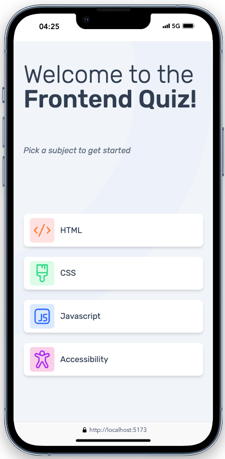
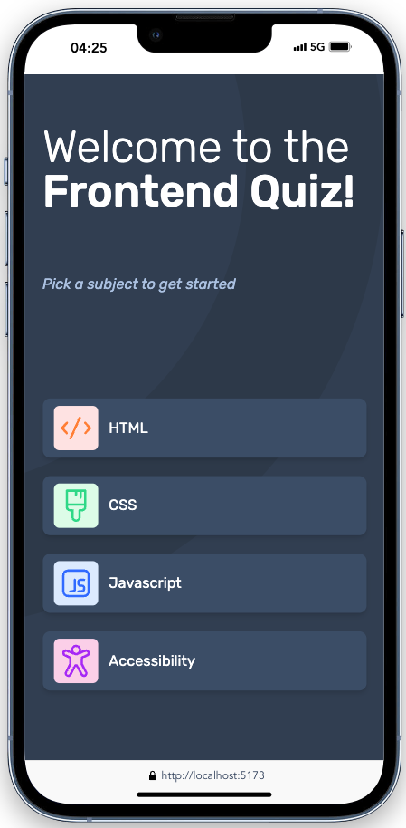
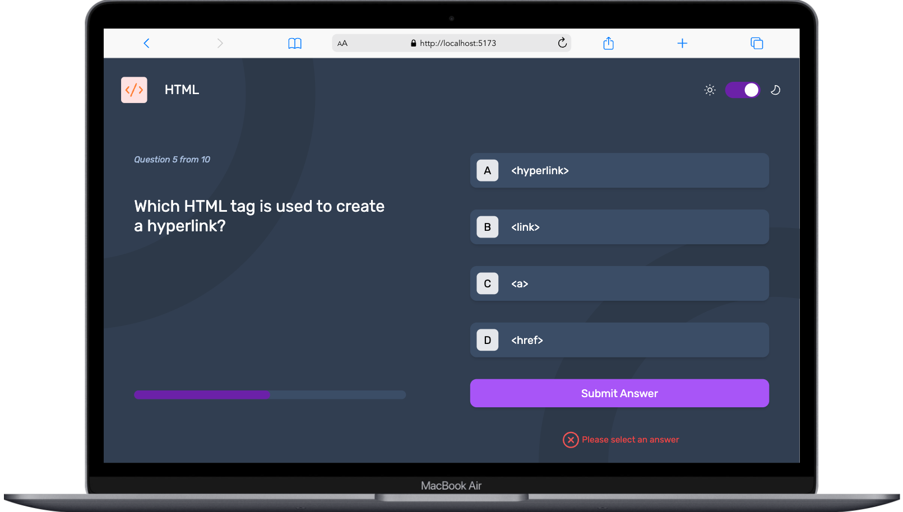
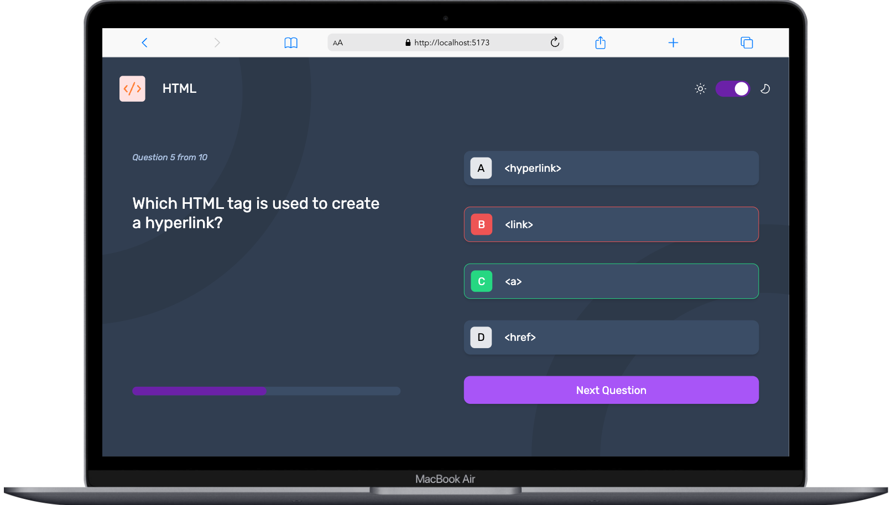
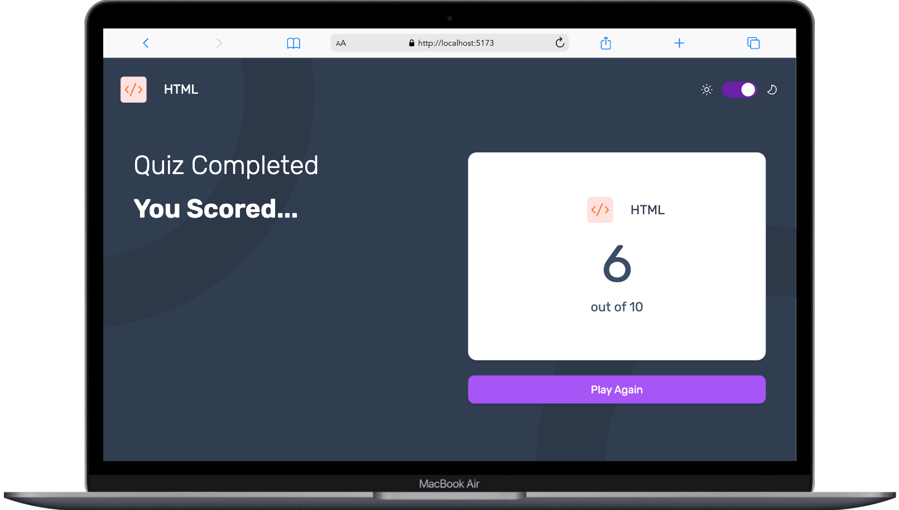

# Frontend Mentor - Frontend quiz app solution

This is a solution to the [Frontend quiz app challenge on Frontend Mentor](https://www.frontendmentor.io/challenges/frontend-quiz-app-BE7xkzXQnU). Frontend Mentor challenges help you improve your coding skills by building realistic projects.

## Table of contents

- [Frontend Mentor - Frontend quiz app solution](#frontend-mentor---frontend-quiz-app-solution)
  - [Table of contents](#table-of-contents)
  - [Overview](#overview)
    - [The challenge](#the-challenge)
    - [Screenshot](#screenshot)
    - [Links](#links)
  - [My process](#my-process)
    - [Built with](#built-with)
    - [What I learned](#what-i-learned)
    - [Continued development](#continued-development)
    - [Useful resources](#useful-resources)
  - [Author](#author)
  - [Acknowledgments](#acknowledgments)

## Overview

### The challenge

Users should be able to:

- Select a quiz subject
- Select a single answer from each question from a choice of four
- See an error message when trying to submit an answer without making a selection
- See if they have made a correct or incorrect choice when they submit an answer
- Move on to the next question after seeing the question result
- See a completed state with the score after the final question
- Play again to choose another subject
- View the optimal layout for the interface depending on their device's screen size
- See hover and focus states for all interactive elements on the page
- Change the app's theme between light and dark

### Screenshot










### Links

- Solution URL: [Add solution URL here](https://your-solution-url.com)
- Live Site URL: [Add live site URL here](https://your-live-site-url.com)

## My process

### Built with

- [React](https://reactjs.org/) - JS library
- [Tailwind](https://tailwindcss.com/) - CSS framework
- Javascript
- CSS
- Flexbox
- Mobile-first workflow

### What I learned

Through this project, I gained a rough idea of how to create reusable components and custom hooks in React. Although I did not fully implement custom hooks, I began to understand the concept and plan to implement it more extensively in future projects.

To see how to create a custom hook in React, see below:

```js
import { useState, useEffect } from 'react'

export const useQuizData = (src) => {
  const [quizData, setquizData] = useState(null)

  const fetchQuizData = async (src) => {
    try {
      const data = await fetch(src)
      const jsonData = await data.json()

      setquizData(jsonData)
    } catch (error) {
      console.log(`Error in fetching the data: ${error}`)
    }
  }

  useEffect(() => {
    fetchQuizData(src)
  }, [])

  return quizData
}
```

I also learned about functional state updates in React. Although I am not completely used to them yet, I learned when it is necessary to use functional state updates compared to normal state updates. Additionally, I created a responsive design using Tailwind CSS entirely, which was new for me since I previously made my webpages responsive using pure CSS due to the messiness of Tailwind's code.

### Continued development

After this project, my major focus will be to implement custom hooks to make my code more readable. I also plan to explore other CSS frameworks that make the code more readable compared to the mess created when using Tailwind CSS or find a way to make Tailwind CSS code more readable.

### Useful resources

- [Normal Vs Functional State Updates](https://www.linkedin.com/pulse/choosing-right-state-update-method-normal-vs-updates-react-verma-/) - This helped me get a brief idea on when to use normal state updates and when to use functional state updates in React.

## Author

- Frontend Mentor - [@Aayush895](https://www.frontendmentor.io/profile/Aayush895)
- Twitter - [@JhaAayush895](https://x.com/JhaAayush895)

## Acknowledgments

I would like to thank the entire Frontend Mentor team for providing such interesting challenges to test and improve my skills in frontend web development.